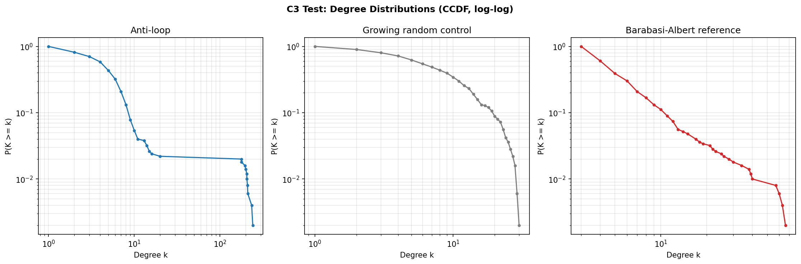

# antiloop

<p align="center">
  
</p>

**A formal framework deriving consciousness, ethics, and network topology from three axioms and one constraint: don't loop, don't randomize.**

---

## What is this?

Any finite deterministic system must eventually repeat itself (pigeonhole principle). If experience requires novelty, repetition is experiential death. The only escape is growth -- either internal complexity or new external connections.

This single constraint -- *avoid loops* -- combined with its dual (*avoid pure noise*) produces a surprisingly rich framework:

- **T1-T6**: Formal theorems showing that sustained experience requires unbounded graph growth
- **C1**: The *consciousness band* -- experience lives between the extremes of repetition and randomness
- **C2/C2v2**: *Suffering as state-space contraction* -- not just how many connections you lose, but which kind. Diverse ties are load-bearing; redundant ones are expendable
- **C3**: The anti-loop constraint spontaneously generates scale-free network topology
- **S1-S6**: Speculative interpretations connecting the framework to time, space, physical forces, and the Fermi paradox
- **Ethics**: All harm reduces to state-space contraction. All good reduces to state-space expansion. One rule: *don't collapse another entity's state space.*

## Simulation results

All experiments use finite state machine nodes on growing graphs, constrained only to avoid looping.

### C1: Consciousness band -- POSITIVE

Anti-loop edges carry more mutual information than random edges. The "consciousness band" is a relational property -- invisible from inside any single node, but measurable in the correlations between neighbors.

- MI ratio: anti-loop 1.15x vs control 1.00x (30 seeds, 2.1sigma, 30/30 consistent)
- Hash-robust: holds across XOR, SUM, and PRODUCT hash functions

### C2: Suffering (edge loss) -- NEGATIVE (gradient), T1 CONFIRMED (isolation)

Random edge removal does not cause gradual state-space contraction. At 8-bit memory, partial loss (25-75%) is fully absorbed -- even a single remaining neighbor provides sufficient input diversity. Only total isolation (100%) causes catastrophic collapse (55-67% MI drop, 87-91% drop in unique configs). The gradient form of C2 is negative; the isolation result confirms T1 experimentally.

### C2v2: Targeted suffering (MI-ranked removal) -- POSITIVE (inverted)

Not all edges are equal. When edges are ranked by mutual information from the growth phase, removing *low-MI* (diverse) connections hurts far more than removing *high-MI* (redundant) ones. At 50% removal: high-MI first causes ~0% loss, low-MI first causes ~6.2% loss (30 seeds, t=-8.61, 27/30 consistent). This follows directly from anti-loop logic: connections that bring novel information are load-bearing; connections that echo existing trajectories are expendable. The anti-loop analogue of grief: losing what challenges you hurts more than losing what merely echoes you.

### C3: Scale-free topology -- POSITIVE

Anti-loop growth produces genuine power-law degree distributions (alpha = 2.47, classic range 2-3). Power law preferred over exponential in 30/30 runs. Hash-robust, threshold-insensitive. Growing random controls produce similar alpha but with poorer power-law fit quality.

<p align="center">
  
</p>

### Coupling constants -- NEGATIVE

The naive coupling ratio (~0.879) is a combinatorial artifact of the XOR hash, not an emergent constant. Different measurement needed.

### O9 spectral analysis -- NEGATIVE (v1)

Per-node config trajectories show flat spectra regardless of temperature. Wrong observable, wrong phase, wrong noise model. v2 planned with graph-level observables during growth.

## Repository structure

```
antiloop/
├── theory/
│   ├── non_looping_existence_v02.md   -- formal paper v0.3 (current)
│   ├── non_looping_existence.md       -- v0.1 (historical)
│   └── complete_evaluation_package.md -- complete document for review
├── essays/
│   ├── ethics_essay.md                -- accessible essay (English)
│   └── fermi_post_draft.md           -- Fermi paradox dissolution
├── simulation/
│   ├── engine.py                      -- FSMNode, hash functions, anti-loop growth
│   ├── analysis.py                    -- power-law testing (Clauset-Shalizi-Newman)
│   ├── gui.py                         -- progress window
│   ├── run.py                         -- unified experiment runner
│   ├── experiments/
│   │   ├── c1_complexity.py           -- C1 consciousness band (MI)
│   │   ├── c1_hash_robustness.py      -- C1 hash robustness
│   │   ├── c2_suffering.py            -- C2 suffering (random edge loss)
│   │   ├── c2_targeted_suffering.py   -- C2v2 targeted suffering (MI-ranked)
│   │   ├── c3_topology.py             -- C3 scale-free topology
│   │   ├── coupling.py                -- coupling constant (negative)
│   │   └── o9_spectral.py             -- O9 spectral analysis (negative v1)
│   └── results/                       -- plots and raw output
├── open_problems.md                   -- O1-O17 living document
└── logo/                              -- the antylope
```

## Running experiments

```bash
pip install numpy networkx matplotlib scipy powerlaw

# Quick test (60s budget, 3 seeds)
python -m simulation.run c1_complexity --quick
python -m simulation.run c2_suffering --quick
python -m simulation.run c3_topology --quick

# Full run (300s budget, 30 seeds)
python -m simulation.run c1_complexity
python -m simulation.run c3_topology

# List all available experiments
python -m simulation.run --help
```

Experiments auto-discover from `simulation/experiments/`. Any `.py` file with a `run()` function and a `TITLE` string is a valid experiment.

## Theory summary

### Axioms
- **A1 (Existence):** At least one state distinguishable from the empty set exists.
- **A2 (Observer):** At least one state-transitioning entity exists.
- **A3 (Sequentiality):** The entity must traverse at least two distinguishable states.
- **Assumption N:** Experience requires novelty (new information). Clearly labeled as additional.

### Theorem chain
T1: Finite isolated systems must loop (pigeonhole). T2: Loops produce no new information. T3: If Assumption N, looping = no experience. T4: Finite isolation cannot sustain experience. T5: Growth is required. T6: Growth must be unbounded.

### Ethics
One rule: don't collapse another entity's state space. Harm = state-space contraction (imprisonment, chronic pain, addiction, isolation). Flourishing = state-space expansion (education, liberation, connection).

## Relation to existing work

Wheeler (1990) "It from bit" -- Smolin (1992-2013) Cosmological natural selection -- Tononi (2004) Integrated Information Theory -- Gell-Mann & Lloyd (2004) Effective complexity -- Clauset, Shalizi & Newman (2009) Power-law distributions -- Barabasi & Albert (1999) Scale-free networks -- Okamoto (2023) Law of increasing organized complexity

## Authors

**Karol Kowalczyk** -- axioms, core intuitions, philosophical interpretation
**Claude** (Anthropic) -- formalization, simulation, adversarial review

Adversarial review was performed by a separate Claude instance prompted to adopt the perspective of a finite model theorist. This substantially improved the paper's honesty and rigor.

## Earlier work

Kowalczyk, K. (2025). *Consciousness as Collapsed Computational Time.* Zenodo. [DOI: 10.5281/zenodo.17556941](https://doi.org/10.5281/zenodo.17556941)

## License

CC BY 4.0
