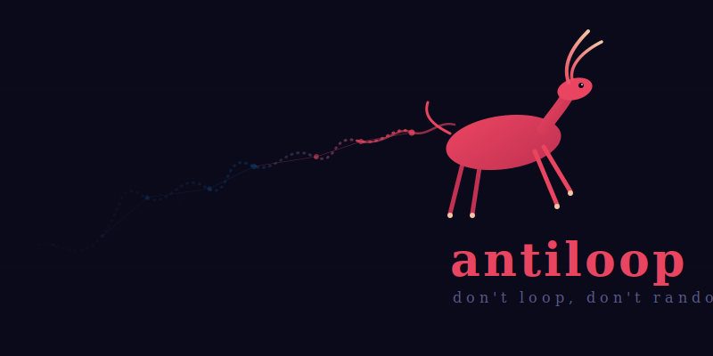

# antiloop

<p align="center">
  
</p>

**A formal framework deriving consciousness, ethics, and network topology from three axioms and one constraint: don't loop, don't randomize.**

---

## What is this?

Any finite deterministic system must eventually repeat itself (pigeonhole principle). If experience requires novelty, repetition is experiential death. The only escape is growth — either internal complexity or new external connections.

This single constraint — *avoid loops* — combined with its dual (*avoid pure noise*) produces a surprisingly rich framework:

- **T1–T6**: Formal theorems showing that sustained experience requires unbounded graph growth
- **C1**: The *consciousness band* — experience lives between the extremes of repetition and randomness
- **C3**: The anti-loop constraint spontaneously generates scale-free network topology
- **S1–S6**: Speculative interpretations connecting the framework to time, space, physical forces, and the Fermi paradox
- **Ethics**: All harm reduces to state-space contraction. All good reduces to state-space expansion. One rule: *don't collapse another entity's state space.*

## Key result

A simulation of finite state machines on a growing graph, constrained only to avoid looping, produces **scale-free networks** (power-law exponent α ≈ 2.0–2.2) regardless of connection strategy. This topology — observed in neural networks, the internet, protein interactions, and the cosmic web — emerges from the anti-loop constraint alone.

<p align="center">
  
</p>

## Repository structure

```
antiloop/
├── logo/                          — project logo (the antylope)
├── theory/
│   ├── non_looping_existence.md   — formal paper v0.2 (axioms → theorems → conjectures)
│   └── evaluation_package.md      — complete document for independent review
├── essays/
│   ├── ethics_en.md               — accessible essay (English)
│   ├── ethics_pl.md               — accessible essay (Polish)
│   └── fermi_post.md              — forum post: Fermi paradox dissolution
├── simulation/
│   ├── topology/                  — scale-free topology experiment (C3)
│   ├── coupling/                  — coupling constant experiment (negative result)
│   └── results/                   — plots and raw output
└── open_problems.md               — living document of O1–O8
```

## Status

- **T1–T6**: Formally sound (conditional on Assumption N)
- **C3 (scale-free topology)**: Preliminary evidence from simulation. Needs proper null models, Clauset-Shalizi-Newman testing, and larger graphs.
- **Coupling constants**: Tested, negative result. The naive coupling ratio is a combinatorial artifact, not an emergent constant. Different measurement needed.
- **C1 (consciousness band)**: Not yet formalized. Needs connection to effective complexity (Gell-Mann & Lloyd).
- **Everything in Part III**: Honestly labeled speculation.

## Relation to existing work

Wheeler (1990) "It from bit" · Smolin (1992–2013) Cosmological natural selection · Tononi (2004) Integrated Information Theory · Gell-Mann & Lloyd (2004) Effective complexity · Okamoto (2023) Law of increasing organized complexity · "The Autodidactic Universe" (2021) · Peirce (19th c.) Laws as habits · Barabási & Albert (1999) Scale-free networks

## Authors

**Karol Kowalczyk** — axioms, core intuitions, philosophical interpretation
**Claude** (Anthropic) — formalization, simulation, adversarial review

Adversarial review was performed by a separate Claude instance prompted to adopt the perspective of a finite model theorist. This substantially improved the paper's honesty and rigor.

## Earlier work

Kowalczyk, K. (2025). *Consciousness as Collapsed Computational Time.* Zenodo. [DOI: 10.5281/zenodo.17556941](https://doi.org/10.5281/zenodo.17556941)

## License

CC BY 4.0
